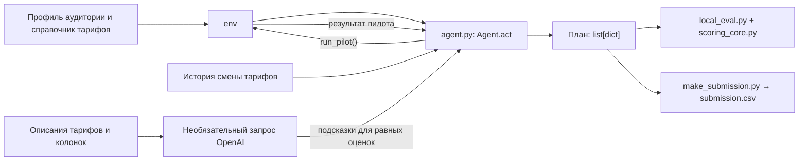

# Агент управления тарифными кампаниями Beeline

Проект для кейса **Beeline Tariff Marketing Campaigns**. Агент планирует кампании по смене тарифа: выбирает аудиторию, целевой тариф и канал связи, проверяет гипотезы пилотами и учитывает бюджет.

## Кому и зачем

Решение рассчитано на аналитика маркетинга, которому нужно выбрать кампании на следующий месяц. Переход на другой тариф может повысить или снизить выручку с абонента (ARPU), а контакт через некоторые каналы стоит денег. Агент помогает автоматически сравнить варианты и вернуть план с ожидаемым положительным чистым результатом.

## Что реализовано

- Анализ аудитории по текущему тарифу и сегменту ARPU.
- Предварительная оценка переходов по истории `data/change_tariff.csv` с запасной стратегией, если история недоступна.
- До 17 пилотов через `env.run_pilot()`, обычно по 200 абонентов. Для разведки используются push и SMS.
- Байесовское обновление оценки эффекта по результатам пилота и вычитание неопределённости перед запуском большой кампании.
- Объединение похожих исходных тарифов с одним сегментом ARPU и целевым тарифом в один фильтр вида `tariff_4;tariff_8`.
- Выбор канала с учётом стоимости, ожидаемого эффекта, контактов и бюджета; проверка выгодного повышения канала на остаток бюджета.
- Необязательная качественная подсказка от LLM. При наличии `OPENAI_API_KEY` агент делает один запрос до пилотов и использует ответ только для разрешения **точного равенства** числовой оценки кандидатов. Без ключа или при ошибке API расчёт продолжается без подсказки.
- Возврат списка не более чем из 10 финальных кампаний и создание `submission.csv`.

## Как работает решение

1. Судейская или локальная среда передаёт в `Agent.act(env)` аудиторию, справочник тарифов, каналы связи и доступные лимиты.
2. Агент группирует абонентов по текущему тарифу и ARPU. История переходов помогает ранжировать гипотезы для пилотов. Если история не читается, кандидаты строятся по аудитории и тарифам из `env`.
3. Агент запускает пилоты и обновляет ожидаемый относительный эффект перехода. Результат пилота переводится в общую шкалу, чтобы сравнивать push и SMS.
4. Для каждой исходной ячейки выбирается лучший проверенный переход с поправкой на неопределённость. Совместимые ячейки объединяются в кампании.
5. Агент распределяет контакты и бюджет между кампаниями, выбирает каналы и возвращает `list[dict]` с фильтрами, `target_tariff` и `channel`. Локальная команда `make_submission.py` записывает этот план в CSV.

Пилоты и финальные кампании расходуют общий бюджет и лимит контактов. Один абонент засчитывается по лучшему для него предложению, поэтому повторный контакт не умножает эффект.

## Архитектура



| Компонент | Назначение |
| --- | --- |
| `agent.py` | Отбор гипотез, пилоты, оценка эффекта, группировка и план кампаний. |
| `environment.py` | Публичный интерфейс среды и проведение пилотов. |
| `mock_environment.py` | Локальная синтетическая среда для воспроизводимой проверки. |
| `local_eval.py`, `scoring_core.py` | Локальный прогон, проверка лимитов и расчёт результата. |
| `make_submission.py` | Генерация `submission.csv` с фиксированным seed 42. |
| `stress_eval.py` | Проверка агента на нескольких изменённых моделях эффектов. |
| `tests/test_llm_optional.py` | Проверка необязательного LLM, ошибок API и таймаута без реального сетевого запроса. |

## Технологии

- **Язык:** Python; проект проверялся с Python 3.12.
- **Библиотеки:** `pandas==3.0.6` и `numpy==2.5.3` из `requirements.txt`. Серверного или веб-фреймворка в проекте нет.
- **LLM, если задан ключ:** `gpt-4.1-mini-2025-04-14` через OpenAI Responses API, строгий JSON Schema. HTTP-запрос выполняется стандартной библиотекой Python (`urllib.request`); OpenAI SDK для запуска не требуется.
- **Локальные тесты:** стандартный модуль `unittest`.

## Данные и интеграции

| Источник | Использование |
| --- | --- |
| `env.customer_profile` | Текущая аудитория: тариф, сегменты и `predicted_arpu`. В локальной среде профиль загружается из `customer_profile.csv`. |
| `env.tariffs` и `env.channels` | Доступные целевые тарифы, стоимость и эффективность каналов. Локальная среда читает тарифы из `data/dict_tariff.csv`. |
| `data/change_tariff.csv` | История переходов для предварительной оценки; это не данные той же аудитории, что оценивается. |
| `env.run_pilot()` | Доступ к результатам пробных кампаний. Скрытая таблица эффектов агенту не передаётся. |
| `tariff_dictionary.csv`, `feature_dictionary.csv` | Публичные описания, отправляемые LLM только при наличии ключа. Профили абонентов и результаты пилотов в запрос не включаются. |
| OpenAI Responses API | Необязательный внешний сервис; один запрос на вызов `act()` с ограничением ожидания 15 секунд, без повторных запросов. |

Файлы `data/traffic.csv` и `data/arpu_monthly.csv` входят в пакет кейса, но текущий агент не читает их напрямую.

## Установка и запуск

Команды ниже выполняются из корня проекта. Пример для PowerShell:

```powershell
python --version
python -m venv .venv
.\.venv\Scripts\Activate.ps1
python -m pip install -r requirements.txt
python local_eval.py
python make_submission.py
```

`OPENAI_API_KEY` **необязателен**. Если он уже задан в окружении процесса, агент попробует получить качественные подсказки. Ключ не хранится в репозитории. Отсутствие ключа и ошибка API не мешают запуску агента.

Для сдачи по условиям кейса нужны `agent.py`, `submission.csv` и
`requirements.txt`. `submission.csv` уже есть в репозитории. Он проверен против
повторного запуска с фиксированным seed **без LLM**. При активном LLM ответ API
может изменить порядок кандидатов с равной оценкой, поэтому точное совпадение
CSV для такого запуска не гарантируется.

## Как проверить решение

```powershell
python local_eval.py
python local_eval.py --runs 10
python -B -X utf8 -m unittest discover -s tests -p test_llm_optional.py -v
python make_submission.py
```

Первый запуск показывает кампании, число пилотов, чистый результат и соблюдение лимитов. `--runs 10` проверяет устойчивость к шуму пилотов на разных seed. Локальная проверка без LLM дала **10 положительных результатов из 10**, медиану чистого результата **4 389 518 у.е.**; это результат мок-модели, не прогноз судейского балла.

Дополнительная проверка на изменённых эффектах:

```powershell
python -B -X utf8 stress_eval.py --runs 20 --policies proposed
```

Подход, результаты и ограничения этой проверки описаны в [STRESS_RESULTS.md](STRESS_RESULTS.md). Диагностика необязательного LLM — в [LLM_CHANGES.md](LLM_CHANGES.md).

## Ограничения

- Эффекты в судейской среде отличаются от локальной мок-модели. Положительный локальный результат не гарантирует такой же результат на скрытых данных.
- Агент в основном выбирает пилоты среди положительных исторических гипотез. Выгодный переход, которого история не подсказала, может остаться непроверенным.
- Число и размер пилотов заданы заранее. Текущая версия не меняет их адаптивно после каждого нового результата.
- Финальные фильтры используют текущий тариф и сегмент ARPU; отдельный подбор по `data_segment` и `call_segment` не реализован.
- Распределение бюджета эвристическое: агент не гарантирует математически оптимальный план и может оставить часть бюджета неиспользованной.
- LLM влияет только на порядок кандидатов при точном равенстве их числовой оценки. Его подсказки не заменяют пилоты или предварительную оценку по истории.
- Ожидание LLM ограничено 15 секундами на вызов `act()`. Команда с `--runs 10` вызывает агента десять раз и при наличии ключа может сделать до десяти запросов API.

Ограничения кейса: до 10 финальных кампаний, до 5000 абонентов в каждой, до 15 000 контактов и 100 000 у.е. с учётом пилотов, до 20 пилотов по 10–200 абонентов.

## Развёрнутая версия

Ссылки на развёрнутую версию в репозитории нет. Решение запускается локально через командную строку.
